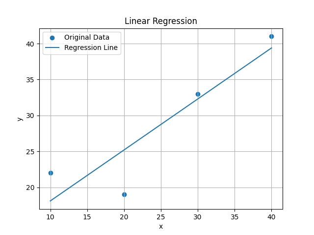

# Linear Regression

Implementation of the Linear Regression algorithm from scratch using Python.

---

##  Description

This project implements Linear Regression without using machine learning libraries such as Scikit-learn or NumPy.

The program calculates:

- Mean of x and y
- Slope (m)
- Intercept (b)
- Regression equation
- Predictions
- Residuals
- Mean Squared Error (MSE)
- Coefficient of Determination (R²)
- Regression plot

---

##  Project Structure

```
regression/
│
├── linear_regression.py
├── README.md
└── regression_plot.png
```

---

## How to Run

Clone the repository:

```bash
git clone https://github.com/claudioalejandroYR/numerical-methods.git
```

Go to the project folder:

```bash
cd numerical-methods/regression
```

Run the program:

```bash
python3 linear_regression.py
```

---

##  Example Output

```text
Slope (m): 0.71
Intercept (b): 11.00

Regression equation:
y = 0.71x + 11.00

Mean Squared Error (MSE): 14.1750

R²: 0.8164
```

---

## Regression Plot

```markdown

```

---

##  Technologies

- Python 3
- Matplotlib

---

## Author

**Claudio Yévenes Rojas**

Engineering Student – Universidad Mayor
